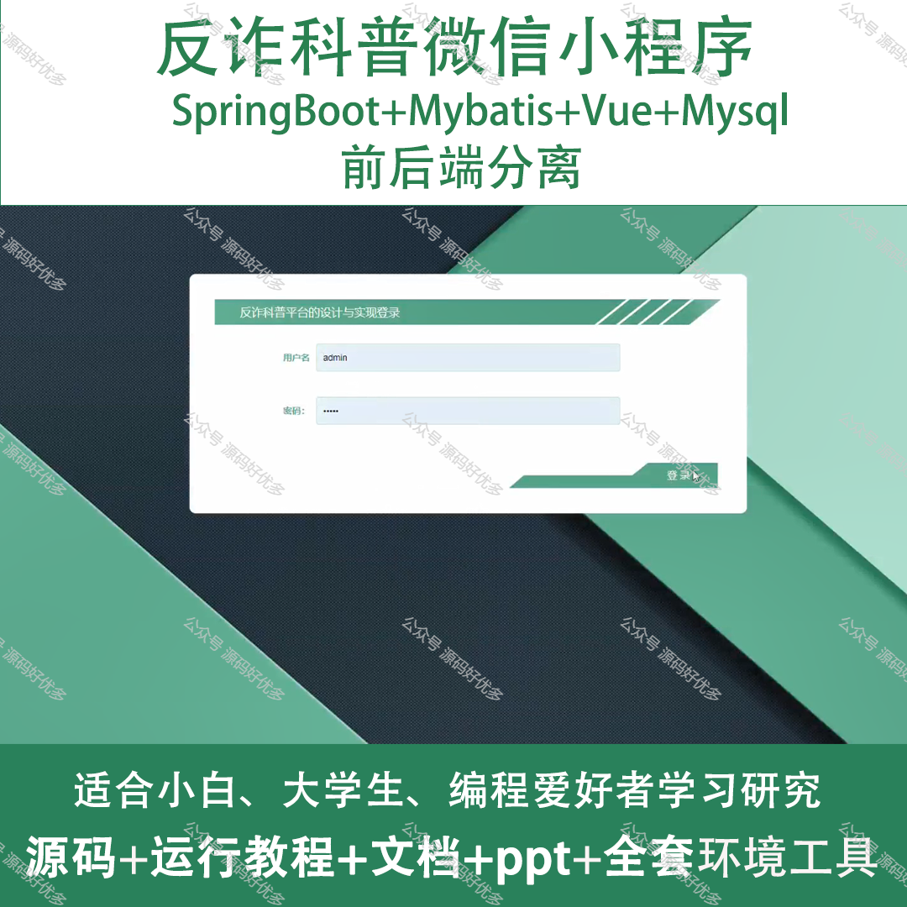
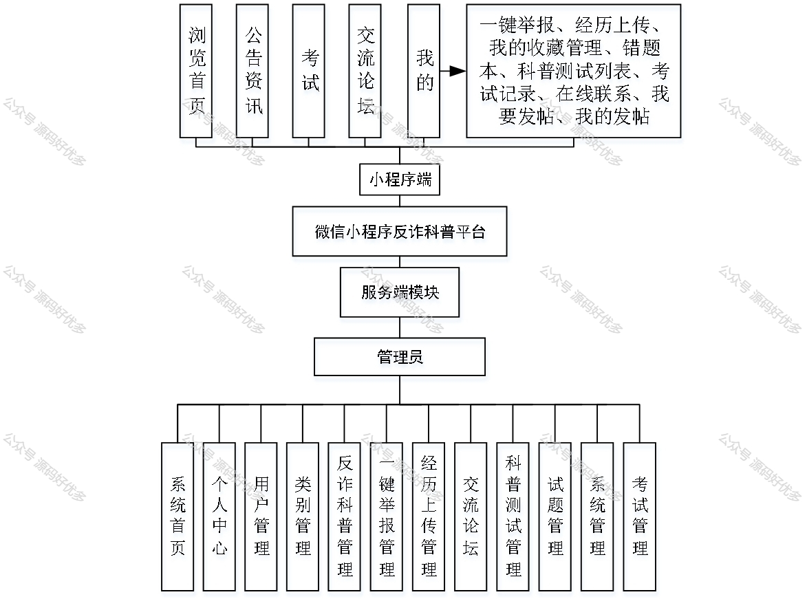
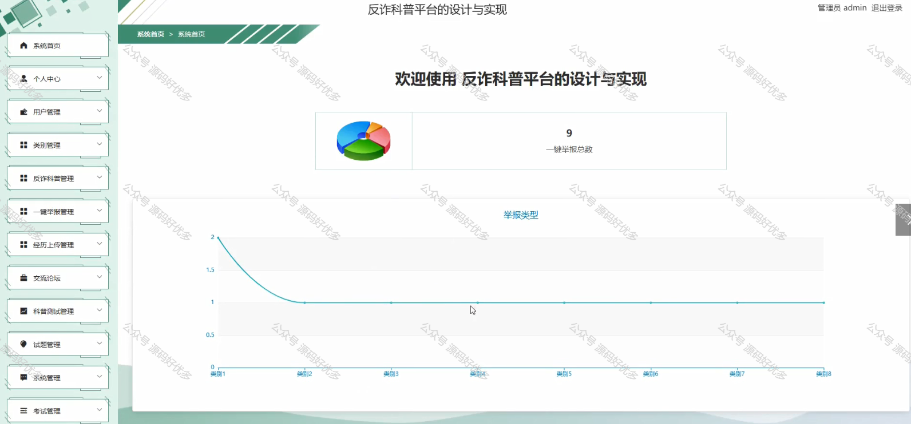
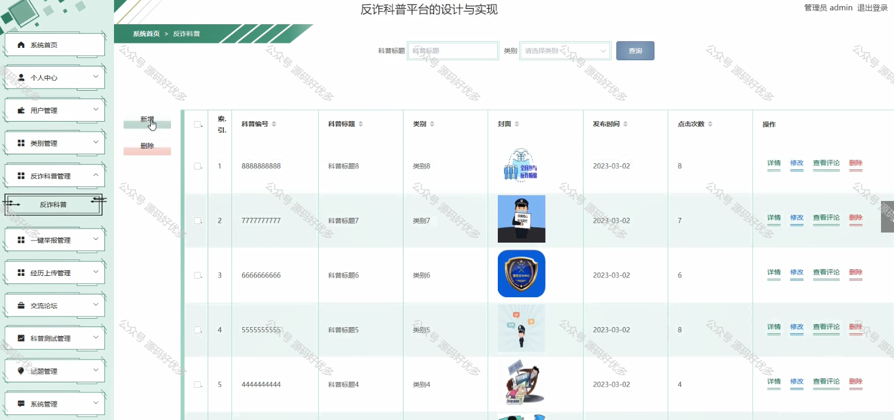
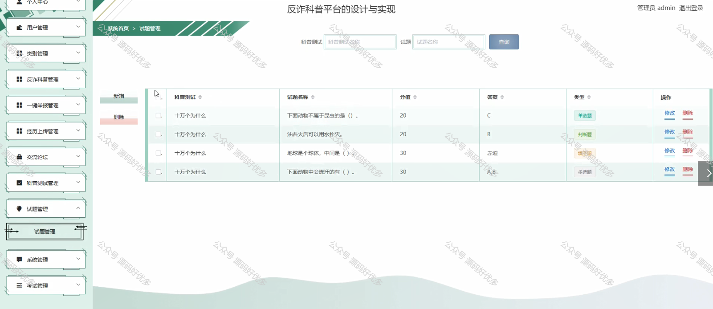
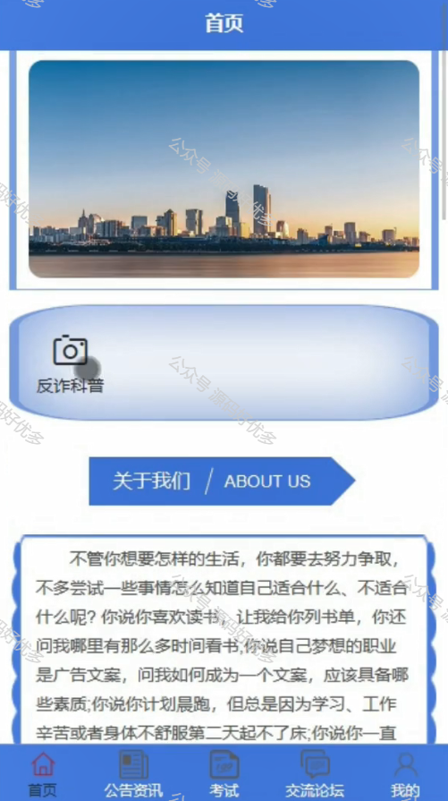
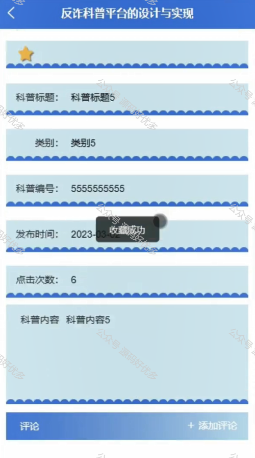
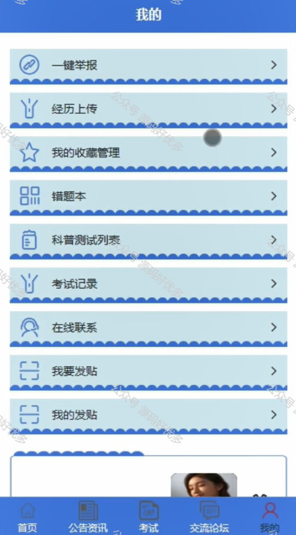
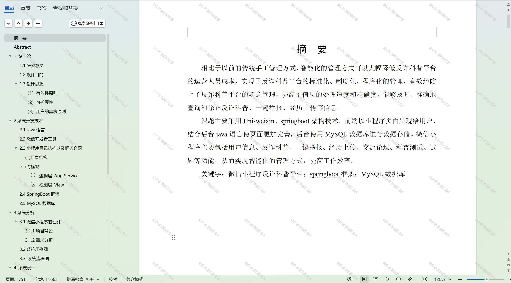

 
## 查看主页获取源码

> **作者介绍**： **✌**全网粉丝10W+本平台特邀作者、博客专家、CSDN新星计划导师、java领域优质创作者,博客之星、掘金/华为云/阿里云/InfoQ等平台优质作者、专注于项目实战 **✌**

  

### 一、作品包含

源码+数据库+设计文档万字+PPT+全套环境和工具资源+部署教程

### 二、项目技术

前端技术：Html、Css、Js、Vue、Element-ui

数据库：MySQL

后端技术：Java、Spring Boot、MyBatis

  

### 三、运行环境

开发工具：IDEA/eclipse + 微信开发者工具

数据库：MySQL5.7

数据库管理工具：Navicat10以上版本

环境配置软件： JDK1.8+Maven3.6.3

前端Nodejs：14

### 四、项目介绍
项目编号：mpweixinA013

"反诈科普"微信小程序，致力于构建一个全民反诈骗的科普平台，旨在提高公众的防骗意识和自我保护能力。在这个信息爆炸的时代，诈骗手段层出不穷，我们通过提供最新的反诈骗资讯、案例分析、防范技巧等内容，帮助用户识别和远离各种诈骗陷阱。让每一位用户都能成为防范诈骗的行家里手，共同营造一个安全、和谐的网络环境。加入我们，一起守护自己和家人的财产安全。

前台用户功能：浏览首页、公告资讯、考试、交流论坛、一键举报、经历上传、我的收藏管理、错题本、科普测试列表、考试记录、在线联系、我要发帖、我的发帖。

后台管理员的功能：系统首页、个人中心、用户管理、类别管理、反诈科普管理、一键举报管理、经历上传管理、交流论坛、科普测试管理、试题管理、系统管理、考试管理。

### 五、运行截图

  

